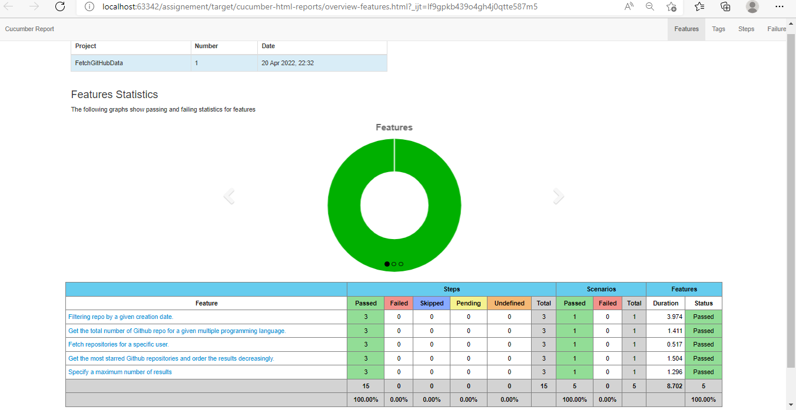

  
Candidate Name- Bahubali Gebise.
Framework : Test Automation project with Cucumber-BDD framework along with cucumber reporting.
  
Please find below scenarios details :
  
  |-------------|-----------------------------------------------------------------------------------|
  |TestCase ID  |                           **Scenarios Name**                                      |
  |-------------|-----------------------------------------------------------------------------------|
  |   UC01      | Fetching the total number of Github repositories for a given programming language |
  |-------------|-----------------------------------------------------------------------------------|
  |   UC02      |                       Filter by a given creation date                             |
  |-------------|-----------------------------------------------------------------------------------|
  |   UC03      |                 Specify more than one programming language                        |
  |-------------|-----------------------------------------------------------------------------------|
  |   UC04      |                     Fetch repositories for a specific user                        |
  |-------------|-----------------------------------------------------------------------------------|
  |   UC05      |   Fetch the most starred Github repositories and order the results decreasingly.  |
  |-------------|-----------------------------------------------------------------------------------|
  |   UC06      |                 Specify a maximum number of results                               |
  |-------------|-----------------------------------------------------------------------------------|
  
 The Goal of this API is to fetch required data or records from GitHub Repositories.

**Project Details**

 1. Please find below Automation Project basic information:
      A. Scenarios are written at .feature file under 'Feature' folder.
      B. Input parameters reading based on TestCase-ID from GitHub_TestData.csv file under 'TestData' folder.
      C. Input Data reading logic implemented at ReadFromCSV.java under 'Util' folder.
      D. StepDefinitions files are having methods and logic implemented at Implementation class's (Under 'Core' folder).
    
 2. Run _TestRunner_ file- under TestRunner folder.
    - All feature files under Feature folder will be executed. 
     
 3.We can execute scenarios via Terminal(IDE- intellij) :

    - mvn clean test -Dcucumber.filter.tags="@API"
    - and cucumber report will be created under target\cucumber-html-reports\overview-features.html
    - If report not updated under target folder then pleas right click on 'target' and click on 'load from Disk' option.

**Scenarios Details**

|-------------|-----------------------------------------------------------------------------------|
|TestCase ID  |                           **Scenarios Name**                                      |
|-------------|-----------------------------------------------------------------------------------|
|   UC01      | Fetching the total number of Github repositories for a given programming language |
|-------------|-----------------------------------------------------------------------------------|
|   UC02      |                       Filter by a given creation date                             |
|-------------|-----------------------------------------------------------------------------------|
|   UC03      |                 Specify more than one programming language                        |
|-------------|-----------------------------------------------------------------------------------|
|   UC04      |                     Fetch repositories for a specific user                        |
|-------------|-----------------------------------------------------------------------------------|
|   UC05      |   Fetch the most starred Github repositories and order the results decreasingly.  |
|-------------|-----------------------------------------------------------------------------------|
|   UC06      |                 Specify a maximum number of results                               |
|-------------|-----------------------------------------------------------------------------------|

UC01 : Fetching repositories based on given programming languages.
     
     1. Url created : https://api.github.com/search/repositories?q=language:Java&sort=created&order=desc
     2. I am reading programming language name from input test date[.csv] file. For Example- Java .
     3. Added assertion on response 'language : Java' .
     4. Please find below sample console output
       ==============Verify Given languages=======================
        Actual Language Name from API : Java : Expected Given Language Name : Java
        Actual Language Name from API : Java : Expected Given Language Name : Java
        Actual Language Name from API : Java : Expected Given Language Name : Java

UC02 :  Filter by a given creation date.
    1. Url created : https://api.github.com/search/repositories?q=created:2020-12-13
    2. I am reading CreationDate value from input test date[.csv] file. For Example- 2020-12-13 .
    3. Please find below sample console output
       ==================Verify Given CreationDate from Response=========================
       Actual Creation Date from API : 2020-12-13T01:42:31Z :  Expected CreationDate : 2020-12-13
       Actual Creation Date from API : 2020-12-13T15:10:47Z :  Expected CreationDate : 2020-12-13
       Actual Creation Date from API : 2020-12-13T15:09:31Z :  Expected CreationDate : 2020-12-13

UC03 : Fetching the total number of Github repositories for a given multiple programming language.
   1. URL Created: https://api.github.com/search/repositories?q=language:Java+or+language:ruby+or+language:Python
   2. I am reading programming language names from input test date[.csv] file. For Example- Java,ruby,Python. 
   3. At test data file provided 3 languages(Java#ruby#Python) and at code level split them by '#' ,
   4. Please find below sample console output 
   ==================Verify Given more than one Programing language from Response=========================
    Actual ProgramLanguages from API : Python :  Expected languages from this list : Java#ruby#Python
    Actual ProgramLanguages from API : Java :  Expected languages from this list : Java#ruby#Python
    Actual ProgramLanguages from API : Python :  Expected languages from this list : Java#ruby#Python
    Actual ProgramLanguages from API : Ruby :  Expected languages from this list : Java#ruby#Python

UC04 :  Fetch the github repositories for a specific user
   1. URL created : https://api.github.com/search/repositories?q=user:shelhamer
   2. I am reading UserName value from input test date[.csv] file. For Example- shelhamer . 
   3. Please find below sample console output-
    ==================Verify Fetch repositories for a specific user from Response=========================
    Actual UserName from API : shelhamer/fcn.berkeleyvision.org :  Expected User name : shelhamer
    Actual UserName from API : shelhamer/revolver :  Expected User name : shelhamer
    Actual UserName from API : shelhamer/clockwork-fcn :  Expected User name : shelhamer

UC05 :  Fetch the most starred Github repositories and order the results decreasingly.
   1. URL created : https://api.github.com/search/repositories?q=repositories&sort=stars&order=desc
   2. I am reading most starred value-STARS from input test date[.csv] file. For Example- STARS .
   3. Please find below sample console output-
    ============== Verify most starred Github repositories and order the results decreasingly =========================
      Get the MostStarred GitHubRepo and ordered results in decreasingly from API response : {"stargazers_count":37744,....
      Get the MostStarred GitHubRepo and ordered results in decreasingly from API response : {"stargazers_count":35276,....
      Get the MostStarred GitHubRepo and ordered results in decreasingly from API response : {"stargazers_count":31328,....

UC06 :  Specify a maximum number of results
   1. URL created : https://api.github.com/search/repositories?q=repositories
      **Note** -
        Even though over UI portal it shows 9+ Million records for search 'commits' and same things via API not enabled.
        API for commits search - https://api.github.com/search?q=commits&type=commits and getting response as "Not found". 
   2. I am reading value from input test date[.csv] file. For Example- repositories .
   3. Please find below sample console output-
      
        Specify a maximum number of results :repositories and count fetched from API : 1915094
         
         ============== Fetch maximum number of results from GitHub=========================
         repositories maximum number of results from GitHub : laravel-repositories
         repositories maximum number of results from GitHub : MicroOrm.Dapper.Repositories
      
*** Execution Report ***

